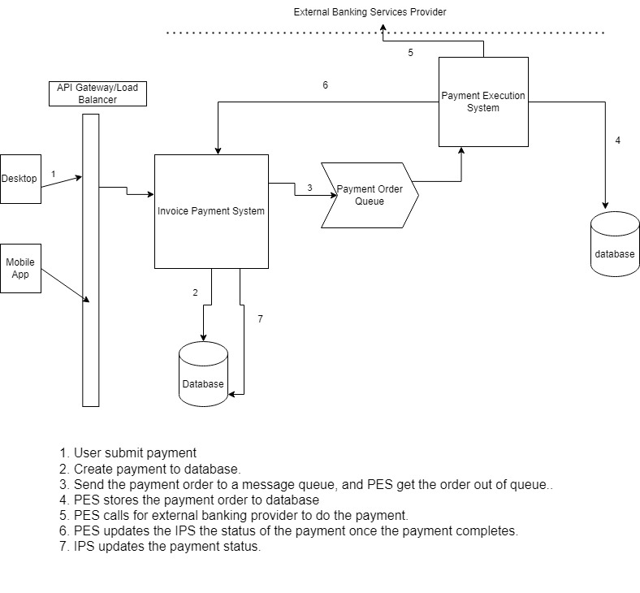

Invoice payment services   

The Swagger is here.       
https://invoicepaymentservicesapi-app-20.wonderfulsea-3ee130f2.centralus.azurecontainerapps.io/swagger/index.html

Visual Studio 2022   
Project target framework: .Net 6.0   
Doceker is for Windows   
 
Assumption:
1. The system does not handle payment processing and rely on third party to do it. Essentially we are a book keeping component.

2. Credit card or banking information (not sure about this one) are not stored in system.

3. Only support one currency.

4. We have 100000 accounts and each account will submit 10 payments.

5. Given the transactions volume, traditional relation database should be adequate.

6. No load testing has been performed in this demo. Only a few unit tests, integration tests, and functional tests are included in this demo.

7. The demo did not provide api for getting one invoice by invoice id. Instead, api is for getting all invoices for a user by account id. 
	The front end should be able to use them to get information for any single invoice. For simplicity, no paging is provided.

8. Since there are date in the payment submit page, I assume that this is for future payment schedule. In this case, I also assume 
	only submit of payment does not automatically change the status of invoice because it could be scheduled in future. Only when we 
	get updated from external component (see desing diagram), we will change the status of both the payment and invoice.

9. After the user submit the payment, our system do the recoring and submit a payment order to another service called Payment Execution System.
	who is going to connect to external banking service provider and do the money transaction as scheduled. It will update our system
	with the status of the payment. The payment order will be something like the following.

Payment Order
Field			Description	                    Type
--------------------------------------------------------
VendorId		Which vender should get paid	GUID
BillToId		which account should pay        GUID
Amount			The pay amount	                Decimal
PayDate			When to send the payment	    DateTime
Currency		The currency for the order	    String(enum)
PaymentId		Pyment id created from IPS	    GUID
PaymentMethod	How the vendor get paid			String(enum)

The design diagram can be found at the root directory.

10. Account table is simple designed just to support the demo.

11. Authentication and authorization are not supported in this demo.

After thought:
1. we may want to use string instead of decimal for money. For storage and transmission only. Use decimal for display.

2. all enum should probably go to database and cache instead of in code.

3. The business logic is not supposed to be done in repository level. I did not realize this issue till the last minute. too
	late to change.
